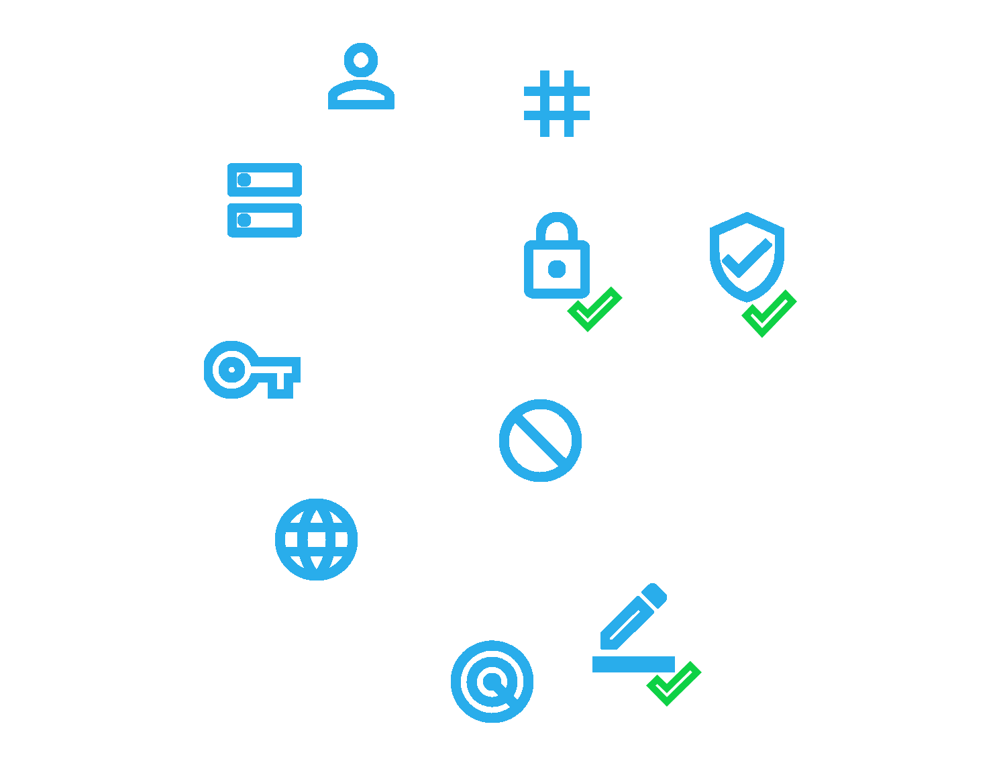
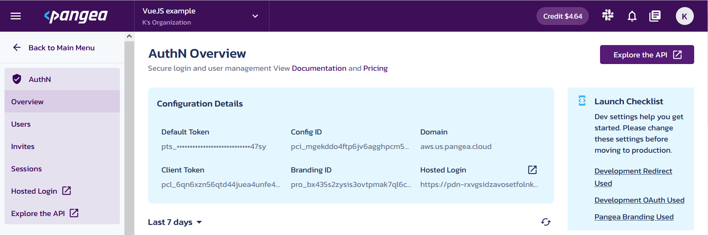
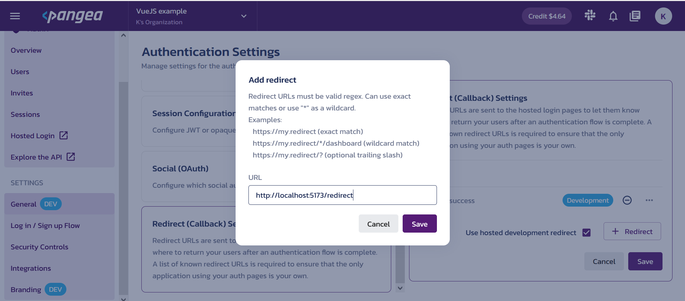
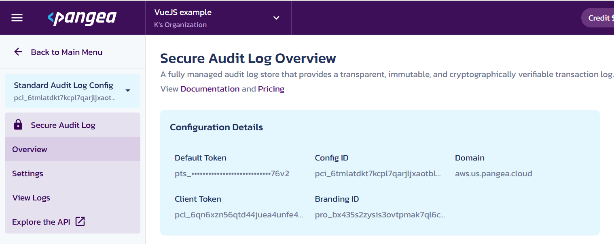
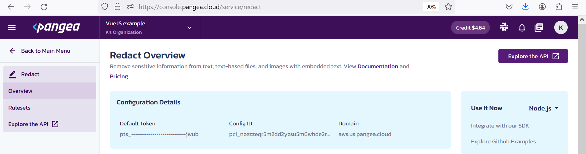
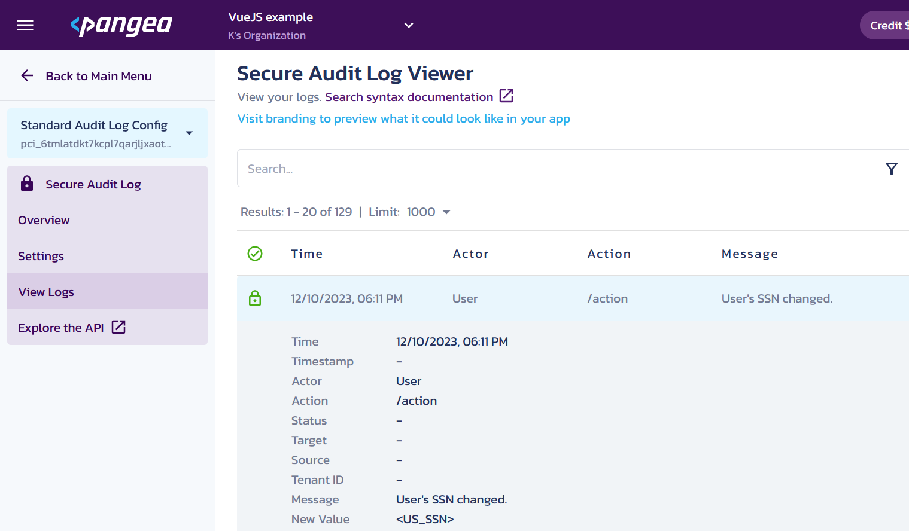
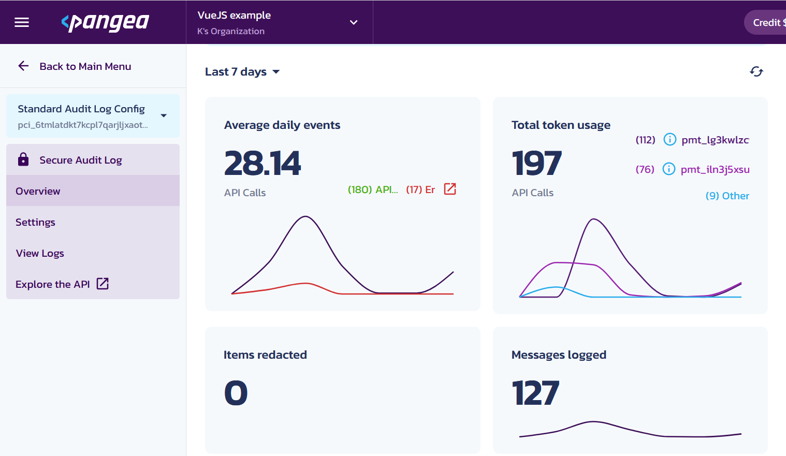

# Add Pangea Security Microservices to your Vue.js App

<a href="https://pangea.cloud/docs/sdk/js/"></a>
<a href="https://pangea.cloud/join-slack/"></a>



## <a id="contents" name="contents"></a>Contents

* [Introduction](#heading-introduction)
* [Prerequisites](#heading-prerequisites)
  * [Local Setup](#heading-prerequisites-local-setup)
  * [Configuring Pangea Services](#heading-prerequisites-pangea-services)
    * [AuthN](#heading-prerequisites-pangea-services-authn)
    * [Secure Audit Log](#heading-prerequisites-pangea-services-secure-audit-log)
    * [Redact](#heading-prerequisites-pangea-services-redact)
* [User Registration and Authentication with AuthN](#heading-authn)
  * [Signing In](#heading-authn-sign-in)
  * [Redirecting](#heading-authn-redirect)
  * [Access Control](#heading-authn-access)
  * [Refresh](#heading-authn-refresh)
  * [Signing Out](#heading-authn-sign-out)
* [Secure Audit Log and Redact](#heading-secure-audit-log)
* [Run the application (in development)](#heading-run-the-application)
* [Sign in](#heading-sign-in)
* [Collect audit logs](#heading-collect-audit-logs)
* [Conclusion](#heading-conclusion)

## <a id="heading-introduction" name="heading-introduction"></a>Introduction

[Back to Contents](#contents)

Privacy and security concerns add [challenging](https://share.hsforms.com/1_4qzzFZmRhSksgcIFBSWvQcswh8?utm_source=website&utm_medium=News&utm_campaign=ESG-website-news) non-functional requirements to the application development, and depending on the use case, certifications may become a necessity. Thus, delegating security tasks to an identity provider (IDP) has become a common practice.

[Pangea.cloud](https://pangea.cloud/) offers several services addressing the following security and privacy concerns:

* Access management.

* Compliance with governing policies.

* Protection of sensitive data.

* Removing harmful content.

* Threat detection.

Choosing Pangea as your IDP will allow you to control the expanding list of security services from a single dashboard, and there are other benefits:

* Integrating Pangea services will not require changes in your application business logic; they can be plugged in, removed, or replaced individually and without disrupting the application flow.

* Pangea services are [certified](https://pangea.cloud) (scroll to the bottom of the page) and will continue to satisfy evolving security and privacy standards.

* Pangea offers a [flexible pricing scheme](https://pangea.cloud/pricing/); you can use only the services you need and to the extent you need them.

* You get help from comprehensive [official docs](https://pangea.cloud/docs), versatile [SDKs](https://pangea.cloud/docs/sdk/), well described [APIs](https://pangea.cloud/docs/api/), and from the active [Pangea community](https://pangea.cloud/company/pangea-community/).

This project demonstrates how security features can be added  to a single-page application (SPA) built with the popular [Vue.js](https://vuejs.org/guide/quick-start.html#creating-a-vue-application) framework by the integration of the following Pangea services:

* [AuthN](https://pangea.cloud/docs/authn/) - for user registration and authentication.

* [Secure Audit Log](https://pangea.cloud/docs/audit/) - for sending event data and storing it securely and tamper-proof.

    > The importance of audit logging has been highlighted in a [recent series of articles](https://pangea.cloud/securebydesign/?series=secure-audit-logging) posted on the Pangea website.

* [Redact](https://pangea.cloud/docs/redact/) - for sanitizing the event data.

The final Vue.js application will look similar to the following:


## <a id="heading-prerequisites" name="heading-prerequisites"></a>Prerequisites

[Back to Contents](#contents)

### <a id="heading-prerequisites-local-setup" name="heading-prerequisites-local-setup"></a>Prerequisites > Local Setup

[Back to Contents](#contents)

* If you haven't done it already, install [Node.js](https://nodejs.org/en).

* Clone or download the Vue.js application and install its dependencies:

  ```sh
  $ git clone https://github.com/lapinek/pangea-cloud-vue.git
  $ cd pangea-cloud-vue
  $ npm install
  ```

  > This example was built with Vue 3 and [Vite](https://vitejs.dev/) as the development server and started by following the official [Quick Start](https://vuejs.org/guide/quick-start.html#creating-a-vue-application) guide.

* Make a copy of the included in the project `.env.example` file, save it in the root of the project, and rename it to `.env.local`.

  [.env.local.example](.env.local.example)

  ```sh
  # Pangea services
  ## Secure Audit Log
  PANGEA_AUDIT_DOMAIN="aws.us.pangea.cloud"
  PANGEA_AUDIT_TOKEN="pts_zybrwxkyskqar7k6tawf4zzw2r6vjwub"
  PANGEA_AUDIT_CONFIG_ID="pci_xxxxxxxxxxxxxxxxxxxxxxxxxxxxxxxx"
  ## Redact
  PANGEA_REDACT_DOMAIN="aws.us.pangea.cloud"
  PANGEA_REDACT_TOKEN="pts_xxxxxxxxxxxxxxxxxxxxxxxxxxxxxxxx"
  ## AuthN
  ### Server side
  PANGEA_AUTHN_TOKEN="pts_xxxxxxxxxxxxxxxxxxxxxxxxxxxxxxxx"
  ### Client side
  VITE_PANGEA_AUTHN_CLIENT_TOKEN="pcl_xxxxxxxxxxxxxxxxxxxxxxxxxxxxxxxx"
  VITE_PANGEA_AUTHN_DOMAIN="aws.us.pangea.cloud"
  VITE_PANGEA_AUTHN_LOGIN_URL="https://pdn-rxvgsidzavosetfolnkvaam2x3q5lx5f.login.aws.us.pangea.cloud"
  VITE_PANGEA_AUTHN_REDIRECT_URI="http://localhost:5173/redirect"

  # API
  VITE_API_URL="http://localhost"
  VITE_API_PORT="3000"
  ```

  In the next steps, you will replace the crossed content with your Pangea project-specific values.

### <a id="heading-prerequisites-pangea-services" name="heading-prerequisites-pangea-services"></a>Prerequisites > Configuring Pangea Services

[Back to Contents](#contents)

You can [start using Pangea services for free](https://pangea.cloud/).

When you select `Start Free`, you will be able to use your email or a supported social platform login to create an account. You will receive a monthly credit that you, as a developer, will have to work hard to exhaust, and that will give you plenty of opportunities to get a good taste of the platform.

As you open your free account, follow the prompts to enable AuthN, Secure Audit Log, and Redact services, or do it later in the [Pangea Console](https://console.pangea.cloud/).

#### <a id="heading-prerequisites-pangea-services-authn" name="heading-prerequisites-pangea-services-authn"></a>Prerequisites > Configuring Pangea Services > AuthN

[Back to Contents](#contents)

After you enabled and configured the AuthN service, navigate to Pangea Console > _your project_ > AuthN > Overview where you can find a set of credentials and parameters that you can use in your application:



* `Domain` is the Pangea service domain.

  Use the `Domain` value to populate the `VITE_PANGEA_AUTHN_DOMAIN` variable in your newly created `.env.local`.

* `Default Token` is a service-level access token that provides access to the entire AuthN service instance and should not be exposed on the client side of your application. You might need this token for performing general administration of the service; for example, terminating all sessions for a user. You can also use the service token to protect your API server that your SPA could be depended on.

  Use the `Default Token` value to populate the `PANGEA_AUTHN_TOKEN` variable in your `.env.local`.

* `Client Token` has limited access to the AuthN instance and can be stored and used in the browser. With the client token, your SPA can authorize calls for signing a user in, refreshing the user session, and terminating the user session on the Pangea server. The respective endpoints used for these calls are described in Pangea's API documentation:

  * https://pangea.cloud/docs/api/authn/session#/v2/client/session/list
  * https://pangea.cloud/docs/api/authn/session#/v2/client/session/logout
  * https://pangea.cloud/docs/api/authn/session#/v2/client/session/refresh

  Use the `Client Token` value to populate the `VITE_PANGEA_AUTHN_CLIENT_TOKEN` variable in your `.env.local`.

* `Hosted Login` can be used for signing in or registering a user, which can serve as an easy introduction to the login functionality in your application.

  Use the `Hosted Login` URI to populate the `VITE_PANGEA_AUTHN_LOGIN_URL` variable in your `.env.local`.

* After signing in with the hosted option, the user will be redirected back to your application with a one-time use token, which can be exchanged for the user's profile and a set of access and refresh tokens for maintaining the client-side session.

  To avoid fishing attempts, the AuthN service instance needs to know what domain is safe to redirect the user to. You can add your allowed redirect URIs by navigating to Pangea Console > _your project_ > General > Redirect (Callback) Settings and selecting `+ Redirect`:

  

  Select `Save` in both dialogs.

  > You don't have to specify the path to your redirect location, but doing so can serve as a reference to the client setup.

  Use the redirect URI value to populate the `VITE_PANGEA_AUTHN_REDIRECT_URI` environment variable in your `.env.local`.

#### <a id="heading-prerequisites-pangea-services-secure-audit-log" name="heading-prerequisites-pangea-services-secure-audit-log"></a>Prerequisites > Configuring Pangea Services > Secure Audit Log

[Back to Contents](#contents)

After you enabled and configured the Secure Audit Log service, navigate to Pangea Console > _your project_ > Secure Audit Log > Overview and capture the credentials and identifiers that you will need for making calls to the service:



* Use the `Domain` value to populate the `PANGEA_AUDIT_DOMAIN` variable in your `.env.local`.

* Use the `Default Token` value to populate the `PANGEA_AUDIT_TOKEN` variable in your `.env.local`.

* `Config ID`, as the name suggests, is a service configuration ID, and in the case of Secure Audit Service, there can be multiple configurations per service instance.

  If a token is associated with more than one configuration, you MUST provide a configuration ID in your service request. Because the client might not be aware of changes in the service, it is the best practice to always include the configuration ID in your Secure Audit Service requests.

  Use the desired `Config ID` value to populate the `PANGEA_AUDIT_CONFIG_ID` variable in your `.env.local`.

#### <a id="heading-prerequisites-pangea-services-redact" name="heading-prerequisites-pangea-services-redact"></a>Prerequisites > Configuring Pangea Services > Redact

[Back to Contents](#contents)

After you enabled and configured the Redact service, navigate to Pangea Console > _your project_ > Redact > Overview and capture the domain and the service token values, which you will need for making calls to the service:



* Use the `Domain` value to populate the `PANGEA_REDACT_DOMAIN` variable in your `.env.local`.

* Use the `Default Token` value to populate the `PANGEA_REDACT_TOKEN` variable in your `.env.local`.

> Note that different prefixes in Pangea tokens indicate their designation, such as `service`, `client`, `refresh` token, etc.

## <a id="heading-authn" name="heading-authn"></a>User Registration and Authentication with AuthN

[Back to Contents](#contents)

In this project, user registration and authentication is implemented with the Pangea hosted login pages.

### <a id="heading-authn-sign-in" name="heading-authn-sign-in"></a>User Registration and Authentication with AuthN > Signing In

[Back to Contents](#contents)

When a user wants to sign in, you can send them to the hosted login page. In the example app, this is done in a composable function, which is called when the user selects `Sign In`:

[src/composables/auth.js#L101-L119](src/composables/auth.js#L101-L119)

```javascript
const signIn = () => {
  const state = generateBase58(32)
  localStorage.setItem('state', state) // 1

  let localRedirectUri = import.meta.env.VITE_PANGEA_AUTHN_REDIRECT_URI // 2

  const query = new URLSearchParams('')
  query.append('redirect_uri', localRedirectUri)
  query.append('state', localStorage.getItem('state'))

  const queryParams = query.toString()
  const redirectTo = import.meta.env.VITE_PANGEA_AUTHN_LOGIN_URL // 3
  const url = queryParams ? `${redirectTo}?${queryParams}` : redirectTo

  window.location.replace(url) // 4
}
```

1. Generate a unique state value, which will be checked against to prevent [Cross-site request forgery (CSRF)](https://en.wikipedia.org/wiki/Cross-site_request_forgery) attacks on redirecting back to the application.

1. Get the redirect URI from an environment variable defined in `.env.local`. The required variables are

1. Get the Hosted Login URI copied from the Pangea Console and saved in a local environment variable.

1. Send the user to the Sign In / Register hosted page.

The `signIn` function will be called when the user presses the `Sign In` button in [src/components/NavBar.vue#L27](src/components/NavBar.vue#L27):

```html
...
<button v-if="!store.pangeaSession" @click="signIn">Sign In</button>
...
```

### <a id="heading-authn-redirect" name="heading-authn-redirect"></a>User Registration and Authentication with AuthN > Redirecting

[Back to Contents](#contents)

After the user authenticates to the Pangea server, they will be redirected back with the state and the one-time use token in the URL query to the redirect route you provided in the sign-in request and allowed in the AuthN service Redirect setup.

Eventually, the redirect route will call the `redirect` function:

[src/composables/auth.js#L118-L159](src/composables/auth.js#L118-L159)

```javascript
const redirect = async (route) => {
  const state = localStorage.getItem('state')
  localStorage.removeItem('state')
  if (state !== route.query.state) { // 1
    return false
  }
  let userinfo
  try {
    const response = await fetch(`https://authn.${import.meta.env.VITE_PANGEA_AUTHN_DOMAIN}/v2/client/userinfo`, { // 2
      method: 'POST',
      headers: {
        'Authorization': `Bearer ${import.meta.env.VITE_PANGEA_AUTHN_CLIENT_TOKEN}`,
        'Content-Type': 'application/json'
      },
      body: JSON.stringify({
        code: route.query.code
      })
    })
    userinfo = await response.json()
  } catch (e) {
    console.log('Failed to fetch tokens.', e.message)
  }

  if (userinfo?.status === 'Success') { // 3
    const user = {
      email: userinfo.result.active_token.email,
      profile: userinfo.result.active_token.profile,
      active_token: userinfo.result.active_token,
      refresh_token: userinfo.result.refresh_token
    }
    delete user.active_token.email
    delete user.active_token.profile
    delete user.refresh_token.email
    delete user.refresh_token.profile
    localStorage.setItem('pangea-session', JSON.stringify({ // 4
      user
    }))
  } else {
    return false
  }
  return true
}
```

1. Make sure the state received in the redirect matches its original value in the sign-in request.

2. Exchange the one-time use token for the user profile and access and refresh tokens.

3. In the case of success, normalize the user profile and the tokens' info.

4. Save the user profile and the tokens in a browser storage, so that they persist between application reloads.

### <a id="heading-authn-access" name="heading-authn-access"></a>User Registration and Authentication with AuthN > Access Control

[Back to Contents](#contents)

Once the current user session is saved locally, you can use it to control access to the application's protected routes and API endpoints.

When a protected route is requested by the user, a route guard will call a function checking the authentication status:

[src/composables/auth.js#L4-L48](src/composables/auth.js#L4-L48)

```javascript
const isAuthenticated = async () => {
  const pangeaSession = getLocalStorageItem('pangea-session') // 1

  if (!pangeaSession) {
    await signOut()
    return false
  }

  const timeLeft = (new Date(pangeaSession.user?.active_token?.expire) - Date.now()) // 2
  if (Math.sign(timeLeft) !== 1) {
    await signOut()
    return false
  }

  /**
   * Introspect session on the authorization server.
   */
  try { // 3
    console.log('Introspecting user session on the authorization server.')
    const response = await fetch('https://authn.aws.us.pangea.cloud/v2/client/session/list', {
      method: 'POST',
      headers: {
        'Content-Type': 'application/json',
        'Authorization': `Bearer ${import.meta.env.VITE_PANGEA_AUTHN_CLIENT_TOKEN}`
      },
      body: JSON.stringify({
        'token': pangeaSession.user.active_token.token
      })
    })
    const result = await response.json()
    if (result.status !== 'Success') {
      console.log('Signed out on the authorization server.', result.status)
      await signOut()
      return false
    }
  } catch (e) {
    console.log('Failed to introspect session on the authorization server.', e.message)
    await signOut()
    return false
  }

  store.setSession(pangeaSession) // 4

  return true
}
```

1. Check if a local session exists.

2. Check whether the local session has expired.

3. If the local checks passed, verify the session status on the Pangea server; this can be optional if you instead validate the remote session status on an API server.

4. Store the session in the Vue.js application so that its components can use it as a reference and hide the protected parts of the user interface (UI) when the user is not signed in.

### <a id="heading-authn-refresh" name="heading-authn-refresh"></a>User Registration and Authentication with AuthN > Refresh

[Back to Contents](#contents)

In Pangea Console > _your project_ > General > Session Configuration > Token Lifetimes, you can adjust how long-lived your access and refresh tokens are. Then, you could use the local session information to inform the user about imminent session expiration and provide an option to extend it:

[src/composables/auth.js#L50-L98](src/composables/auth.js#L50-L98)

```javascript
const refresh = async () => {
  const pangeaSession = getLocalStorageItem('pangea-session') // 1

  if (!pangeaSession) {
    await signOut()
    return false
  }

  /**
   * Refresh the session on the authorization server.
   */
  try { // 2
    console.log('Refreshing user session on the authorization server.')
    const response = await fetch('https://authn.aws.us.pangea.cloud/v2/client/session/refresh', {
      method: 'POST',
      headers: {
        'Content-Type': 'application/json',
        'Authorization': `Bearer ${import.meta.env.VITE_PANGEA_AUTHN_CLIENT_TOKEN}`
      },
      body: JSON.stringify({
        'refresh_token': pangeaSession.user.refresh_token.token
      })
    })
    const result = await response.json()
    if (result.status !== 'Success') {
      console.log('Failed to refresh the session on the authorization server.', result.status)
      return false
    }

    pangeaSession.user = { // 3
      email: result.result.active_token.email,
      profile: result.result.active_token.profile,
      active_token: result.result.active_token,
      refresh_token: result.result.refresh_token
    }
    delete pangeaSession.user.active_token.email
    delete pangeaSession.user.active_token.profile
    delete pangeaSession.user.refresh_token.email
    delete pangeaSession.user.refresh_token.profile
  } catch (e) {
    console.log('Failed to refresh the session on the authorization server.', e.message)
    return false
  }

  setLocalStorageItem('pangea-session', pangeaSession) // 4
  store.setSession(pangeaSession) // 5

  return true
}
```

1. Check if a local session exists.

2. Attempt to refresh the user's session on the Pangea server.

3. In the case of success, normalize the user profile and the tokens' info.

4. Store the updated user profile and tokens in a browser storage, so that it survives page reloads.

5. Store the session in the Vue.js application so that its components can use the updated session info as a reference (without relying on a navigation event that might not occur at the time of refreshing the session).

### <a id="heading-authn-sign-out" name="heading-authn-sign-out"></a>User Registration and Authentication with AuthN > Signing Out

[Back to Contents](#contents)

Finally, when the user decides to sign out, the local session information will be used to terminate the remote session on the Pangea server by calling the `/v2/client/session/logout` endpoint:

[src/composables/auth.js#L160-L194](src/composables/auth.js#L160-L194)

```javascript
const signOut = async () => {
  console.log('Signing out on the authorization server.')
  const pangeaSession = getLocalStorageItem('pangea-session')
  if (pangeaSession) {
    try {
      const response = await fetch("https://authn.aws.us.pangea.cloud/v2/client/session/logout", {
        method: 'POST',
        headers: {
          'Content-Type': 'application/json',
          'Authorization': `Bearer ${import.meta.env.VITE_PANGEA_AUTHN_CLIENT_TOKEN}`
        },
        body: JSON.stringify({
          'token': pangeaSession.user.active_token.token
        })
      })
      const result = await response.json()
      if (result.status !== 'Success') {
        console.log('Failed to sign out on the authorization server.', result.status)
      }
    } catch (e) {
      console.log('Failed to sign out on the authorization server.', e.message)
      return false
    }
  } else {
    console.log(
      'Failed to sign out on the authorization server: no local session found.'
    )
  }

  console.log('Signing out locally.')
  localStorage.removeItem('pangea-session')
  store.unsetSession()

  return true
}
```

In the components and the [src/router/index.js](src/router/index.js) code, you can see how this AuthN-specific functionality is interconnected with the UI. Similarly, you can implement the client-side authentication functions in another Vue.js project, addressing its application-specific requirements and leveraging its capabilities.

## <a id="heading-secure-audit-log" name="heading-secure-audit-log"></a>Secure Audit Log and Redact

[Back to Contents](#contents)

Most of the Pangea security services accept service-level bearer tokens as the authorization means. Securely storing long-lived bearer credentials in user browsers presents a challenge, and needs to be accompanied by extra security measures on the authorization server. Thus, it might be advisable to move operations relying on long-lived service-wide secrets to the backend.

In addition, moving to the server side will allow us to use Pangea [Node.js SDK](https://pangea.cloud/docs/sdk/js/), instead of calling the Pangea API endpoints directly as has been demonstrated in the AuthN service example. [Express.js](https://expressjs.com/) is a popular Node.js framework for implementing a backend and will be used in the following examples. The service tokens will never be exposed to the client side, and will only be used by the backend for accessing Pangea services.

As an abstract example, a component in the Vue.js application will call a function to submit data to the backend API:

[src/composables/api.js#L1-L11](src/composables/api.js#L3-L21)

```javascript
const postAuditLog = async (data) => {
  if (!store.pangeaSession) {
    console.log(`${data.action} failed to log.`, 'Signed out.')
    return false
  }

  fetch('/api/audit-log', {
    method: 'POST',
    headers: {
      'Content-Type': 'application/json',
      'Authorization': `Bearer ${ store.pangeaSession?.user?.active_token?.token }`
    },
    body: JSON.stringify(data)
  }).catch((e) => {
    console.log(`${data.action} failed to log.`, e)
  })

  return true
}
```

> An `/api` request will be redirected to the backend API.
> Locally, in development, routing to the correct backend server can be enabled by adding a proxy to the [Vite server configuration](https://vitejs.dev/config/server-options.html):
>
> [vite.config.js#L16-27](vite.config.js#L16-27)
>
> ```javascript
> ...
> server: {
>   /**
>     * Add local proxy for the backend API in development.
>     */
>   proxy: {
>     '/api': {
>       target: `${ env.VITE_API_URL }:${ env.VITE_API_PORT }`,
>       changeOrigin: true,
>       rewrite: (path) => path.replace(/^\/api/, '')
>     }
>   }
> }
> ...
> ```

The backend API will attempt to remove sensitive content from the posted data and send it to the Secure Audit Log service; both services will use respective Pangea account credentials loaded via environment variables:

[api/index.js#L15-L80](api/index.js#L15-L80)

```javascript
import { PangeaConfig, AuditService, PangeaErrors, RedactService } from 'pangea-node-sdk'

...

/**
 * Set up Pangea Secure Audit Service.
 * @see {@link https://pangea.cloud/docs/audit/}
 */
const auditToken = process.env.PANGEA_AUDIT_TOKEN // 1
const auditConfig = new PangeaConfig({
    domain: process.env.PANGEA_AUDIT_DOMAIN,
    configID: process.env.PANGEA_AUDIT_CONFIG_ID
})
const audit = new AuditService(auditToken, auditConfig)

/**
 * Set up Pangea Redact Service.
 * @see {@link https://pangea.cloud/docs/redact/}
 */
const redactToken = process.env.PANGEA_REDACT_TOKEN // 2
const redactConfig = new PangeaConfig({
    domain: process.env.PANGEA_REDACT_DOMAIN
})
const redact = new RedactService(redactToken, redactConfig)

...

app.post('/audit-log', (req, res) => { // 3
    (async () => {
        let data = req.body
        const redactResponse = await redact.redactStructured(data) // 4
        if (redactResponse.success) {
            data = redactResponse.result.redacted_data
        } else {
            data = {
                message: `Failed to redact sensitive data: ${redactResponse.code} ${redactResponse.result}. Aborting.`
            }
        }

        try {
            const logResponse = await audit.log(data, { verbose: true })
        } catch (err) {
            if (err instanceof PangeaErrors.APIError) {
                console.log(err.summary, err.pangeaResponse)
            } else {
                throw err
            }
        }
    })()
    res.send('Secure Audit Log executed.')
})

...
```

1. A new Secure Audit Service configuration is created with the service-specific parameters.

    The audit service can have multiple configurations and your token might be associated with more than one; if that is the case, you MUST specify a configuration to use. Because new service configurations could be added in the future, it is probably a good idea to always specify a configuration ID for the secure audit logging service. Note, however, that using a service-specific token may help track the use of the service.

    Note also that in the case of the Node.js SDK, the configuration ID argument name is `configID` (and not `config_id` as could be the case in other Pangea SDKs).

    > Because configuration is a service-level entity, it should be specified on the service level. In the future, the `configID` argument may need to be passed into the `AuditService` constructor. Follow Pangea's [documentation](https://pangea.cloud/docs/audit/) for further updates.

1. The Redact service object is configured similarly, except no configuration ID needs to be provided.

1. POSTing to the backend `/audit-log` endpoint initiates a call to the Pangea services.

1. Remove sensitive data from the log content.

You can find additional details and examples  on using Secure Audit Log and Redact services on Pangea's website and examples on GitHub:

* [Secure Audit Log documentation](https://pangea.cloud/docs/audit/)
* [Redact documentation](https://pangea.cloud/docs/redact/)
* [Examples of using the Node.js SDK](https://github.com/pangeacyber/pangea-javascript/tree/main/examples)

## <a id="heading-run-the-application" name="heading-run-the-application"></a>Run the application (in development)

[Back to Contents](#contents)

```sh
$ npm run api

> pangea-cloud-vue@0.0.0 api
> node api/index.js

Listening on port 3000
```

At this point, you will have a running backend.

In a separate terminal session:

```sh
$ npm run dev

> pangea-cloud-vue@0.0.0 dev
> vite

  VITE v4.5.1  ready in 474 ms

  ➜  Local:   http://localhost:5173/
  ➜  Network: use --host to expose
  ➜  press h to show help
```

This will start the Vue.js application which you can access in your browser at the specified local URL.

## <a id="heading-sign-in" name="heading-sign-in"></a>Sign in

[Back to Contents](#contents)

Use the `Sign In` button in the upper right. You will be taken to the hosted login page, where you can sign in or sign up.

After you are signed in, observe the application behavior, and
notice that you can refresh your session when it has a few hours remaining to stay active.

Find more details on configuring and branding the hosted sign-in process in the [AuthN](https://pangea.cloud/docs/authn/) docs.

## <a id="heading-collect-audit-logs" name="heading-collect-audit-logs"></a>Collect audit logs

[Back to Contents](#contents)

Follow the `Action` link in the navigation bar.

In [Pangea Console](https://console.pangea.cloud/service/audit/logs) > _your project_ > Secure Audit Log > View Logs,  you should now see a new audit log with redacted US SSN value:



In the Overview section of a service in Pangea Console, you can find analytics for the service use:



## <a id="heading-conclusion" name="heading-conclusion"></a>Conclusion

[Back to Contents](#contents)

Pangea microservices offer application security as a centralized cloud-based solution agnostic of the business use case your applications might be addressing. The Pangea Console serves as a portal for setting up your application security, hosting sensitive data, collecting logs and preserving their integrity, removing PII and/or harmful content from any text, and analyzing the services' usage. Your application may evolve but stay secure thanks to the abstraction from the application logic Pangea's microservices provide. Implementing these microservices is helped with the provided SDKs and APIs, extensive documentation, and community support.

In other words, dear Reader, Pangea takes you back to the land where you can find all security features for your app in one place!