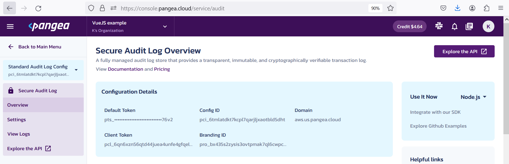

# Example use of Pangea Security Microservices in a Vue.js App

<!-- <a href="https://pangea.cloud?utm_source=github&utm_medium=node-sdk" target="_blank" rel="noopener noreferrer">
    
</a> -->


<!-- <a href="https://pangea.cloud?utm_source=github&utm_medium=node-sdk" target="_blank" rel="noopener noreferrer"></a> -->
<a href="https://pangea.cloud/docs/sdk/js/">
<a href="https://pangea.cloud/join-slack/">


[Pangea.cloud](https://pangea.cloud/) offers pluggable security services that don't require any changes in your application business logic. You can start implementing security measures in your app with the help of versatile [SDKs](https://pangea.cloud/docs/sdk/) provided by Pangea, or by consuming its [APIs](https://pangea.cloud/docs/api/) from any application capable of making a network call. For guidance and support consult the [official docs](https://pangea.cloud/docs) and join the [Pangea community](https://pangea.cloud/company/pangea-community/).

Pangea's services accept bearer tokens as the authorization means. If Single Page Applications (SPAs) play an important role in your business, storing long-lived bearer credentials in user browsers securely presents a challenge, and should be accompanied by extra security measures on the authorization server. Thus, it might be advisable to move operations relying on long-lived secrets to the backend.

This project features a [Vue.js](https://vuejs.org/) application using Pangea [JavaScript SDK](https://pangea.cloud/docs/sdk/js/) with an [Express.js](https://expressjs.com/) backend. The service tokens are never exposed to the client side, and are used by the backend side for accessing Pangea services:

* [Secure Audit Log](https://pangea.cloud/docs/audit/) - sending event data.

    > The importance of audit logging has been highlighted in a [recent series of articles](https://pangea.cloud/securebydesign/?series=secure-audit-logging) posted on the Pangea website.

* [Redact](https://pangea.cloud/docs/redact/) - sanitizing the event data.

## <a id="contents" name="contents"></a>Contents

* [How It Works](#how-it-works)
* [Prerequisites](#prerequisites)
* [Run the application (development)](#run-the-application)
* [Collect audit logs](#collect-audit-logs)
* [Conclusion](#conclusion)

## <a id="how-it-works" name="how-it-works"></a>How It Works

[Back to Contents](#contents)

* Select routes in the Vue.js application can capture the event data and send it to the audit log endpoint provided in the backend, using route-specific [Vue Router Navigation Guards](https://router.vuejs.org/guide/advanced/navigation-guards.html#Per-Route-Guard):

    `src/router/index.js`

    ```javascript
    ...

    routes: [
        ...

        {
            path: '/action',
            name: 'action',
            ...
            beforeEnter: (to) => { // 1
                fetch('/api/audit-log', {
                method: 'POST',
                headers: {
                    'Content-Type': 'application/json'
                },
                body: JSON.stringify({
                    ... // 2
                })
                }).catch((e) => {
                    console.log(`${to.path} failed to log.`, e)
                    // 3
                })
                // 4
            }
        }
    ]

    ...
    ```

    1. A route-specific guard provides access to the original and destination route information. Note that in a real implementation, you will probably pass an array of reusable function(s) executing the API call(s).

    1. Define log content.

    1. You can optionally throw an error or return `false` if the logging attempt fails; this will cancel navigation to this route.

    1. By default, a JavaScript function returns `undefined`, which serves as a signal to proceed with the navigation to this route.

    > Locally, in development, routing to the correct backend server is enabled by adding a proxy to the [Vite](https://vitejs.dev/) development [server configuration](https://vitejs.dev/config/server-options.html):
    >
    > `vite.config.js`
    >
    > ```javascript
    > ...
    >
    > api: {
    >   proxy: {
    >     '/api': {
    >       target: 'http://localhost:3000',
    >       changeOrigin: true,
    >       rewrite: (path) => path.replace(/^\/api/, '')
    >     }
    >   }
    > }
    >
    > ...
    > ```

* The backend will respond to the request and attempt to send the posted data to the Secure Audit Log service. It will use Pangea account credentials loaded via environment variables:

    `api/index.js`

    ```javascript
    ...

    import { PangeaConfig, AuditService, PangeaErrors, RedactService } from 'pangea-node-sdk'

    ...

    /**
     * Set up Pangea Secure Audit Service.
     * @see {@link https://pangea.cloud/docs/audit/}
     */
    const auditToken = process.env.PANGEA_AUDIT_TOKEN // 1
    const auditConfig = new PangeaConfig({
        domain: process.env.PANGEA_AUDIT_DOMAIN,
        configID: process.env.PANGEA_AUDIT_CONFIG_ID
    })
    const audit = new AuditService(auditToken, auditConfig)

    /**
     * Set up Pangea Redact Service.
     * @see {@link https://pangea.cloud/docs/redact/}
     */
    const redactToken = process.env.PANGEA_REDACT_TOKEN // 2
    const redactConfig = new PangeaConfig({
        domain: process.env.PANGEA_REDACT_DOMAIN
    })
    const redact = new RedactService(redactToken, redactConfig)

    ...

    app.post('/audit-log', (req, res) => { // 3
        (async () => {
            let data = req.body
            const redactResponse = await redact.redactStructured(data) // 4
            if (redactResponse.success) {
                data = redactResponse.result.redacted_data
            } else {
                data = {
                    message: `Failed to redact sensitive data: ${redactResponse.code} ${redactResponse.result}. Aborting.`
                }
            }

            try {
                const logResponse = await audit.log(data, { verbose: true })
            } catch (err) {
                if (err instanceof PangeaErrors.APIError) {
                    console.log(err.summary, err.pangeaResponse)
                } else {
                    throw err
                }
            }
        })()
        res.send('Secure Audit Log executed.')
    })

    ...
    ```

    1. A new Secure Audit Service configuration is created with the service-specific parameters.

        Using a service-specific token may help track its use.

        The audit service can have multiple configurations and your token might be associated with more than one; if that is the case, you MUST specify the configuration to use. Because new service configurations could be added in the future, it is probably a good idea to always specify a configuration ID for the secure audit logging service.

        Note, that in the case of the Node.js SDK, the configuration ID argument name is `configID` (and not `config_id` as could be the case in other SDKs).

        > Note also that because configuration is a service-level entity, it should be specified on the service level. In the future, the `configID` argument may need to be passed into the `AuditService` constructor. Follow Pangea's [documentation](https://pangea.cloud/docs/audit/) for further updates.

    1. The Redact service object is configured similarly, except no configuration ID needs to be provided.

    1. POSTing to the backend `/audit-log` endpoint initiates a call to the Pangea services.

    1. Remove sensitive data from the log content.

    You can find additional details and examples  on using Secure Audit Log and Redact services on Pangea's website and examples on GitHub:

    * [Secure Audit Log documentation](https://pangea.cloud/docs/audit/)
    * [Redact documentation](https://pangea.cloud/docs/redact/)
    * [Examples of using the Node.js SDK](https://github.com/pangeacyber/pangea-javascript/tree/main/examples)

## <a id="prerequisites" name="prerequisites"></a>Prerequisites

[Back to Contents](#contents)

* [Start using Pangea services for free](https://pangea.cloud/).

    Select `Start Free`. You can use your email or a supported social platform option to create an account. You will receive a credit that you will have to work hard to exhaust, and that will give you a good taste of the platform.

* As you open your new account, follow the prompts to enable Secure Audit Log and Redact services, or do it later in the [Pangea Console](https://console.pangea.cloud/).

* Capture the credentials and identifiers that you will need for making calls to Pangea's APIs:

    * https://console.pangea.cloud/ > _your project_ > Secure Audit Log > Overview:

        * Default Token
        * Config ID
        * Domain

    * https://console.pangea.cloud/ > _your project_ > Redact > Overview:

        * Default Token
        * Domain

    For example:

    

* Make a copy of the included in the project `.env.example` file, save it in the root of the project, and rename it to `.env`.

    In the file, provide the respective values you collected from the Pangea Console; for example:

    ```sh
    PANGEA_AUDIT_DOMAIN="aws.us.pangea.cloud"
    PANGEA_AUDIT_TOKEN="pts_xxxxxxxxxxxxxxxxxxxxxxxxxxxxxxxx"
    PANGEA_AUDIT_CONFIG_ID="pci_xxxxxxxxxxxxxxxxxxxxxxxxxxxxxxxx"

    PANGEA_REDACT_DOMAIN="aws.us.pangea.cloud"
    PANGEA_REDACT_TOKEN="pts_xxxxxxxxxxxxxxxxxxxxxxxxxxxxxxxx"
    ```

## <a id="run-the-application" name="run-the-application"></a>Run the application (development)

[Back to Contents](#contents)

```sh
$ git clone https://github.com/lapinek/pangea-cloud-vue.git
$ cd pangea-cloud-vue
$ npm install
$ npm run api

> pangea-cloud-vue@0.0.0 api
> node api/index.js

Listening on port 3000
```

At this point, you will have a running backend.

In a separate terminal session:

```sh
$ npm run dev

> pangea-cloud-vue@0.0.0 dev
> vite

  VITE v4.5.1  ready in 474 ms

  ➜  Local:   http://localhost:5173/
  ➜  Network: use --host to expose
  ➜  press h to show help
```

## <a id="collect-audit-logs" name="collect-audit-logs"></a>Collect audit logs

[Back to Contents](#contents)

* Open http://localhost:5173 in your browser.
* Follow the `Action` link.
* In [Pangea Console](https://console.pangea.cloud/service/audit/logs) > _your project_ > Secure Audit Log > View Logs,  you should see a new audit log with redacted US SSN value:

    

    In the Overview section of a service in Pangea Console, you can find analytics for the service use:

    

## <a id="conclusion" name="conclusion"></a>Conclusion

[Back to Contents](#contents)

Pangea microservices offer application security as a centralized cloud-based solution agnostic of the business use case your applications address. The Pangea Console serves as a portal for setting up your application security, hosting sensitive data, collecting logs and preserving their integrity, removing PII from any text, and analyzing the services' usage. Your application may evolve but stay secure thanks to the abstraction from the application logic Pangea's microservices provide. Implementing these microservices is effortless, thanks to the provided SDKs and APIs, which any application capable of making a network call can use.

In other words, dear Reader, Pangea takes you back to the land where you can find all security features for your app in one place :0)